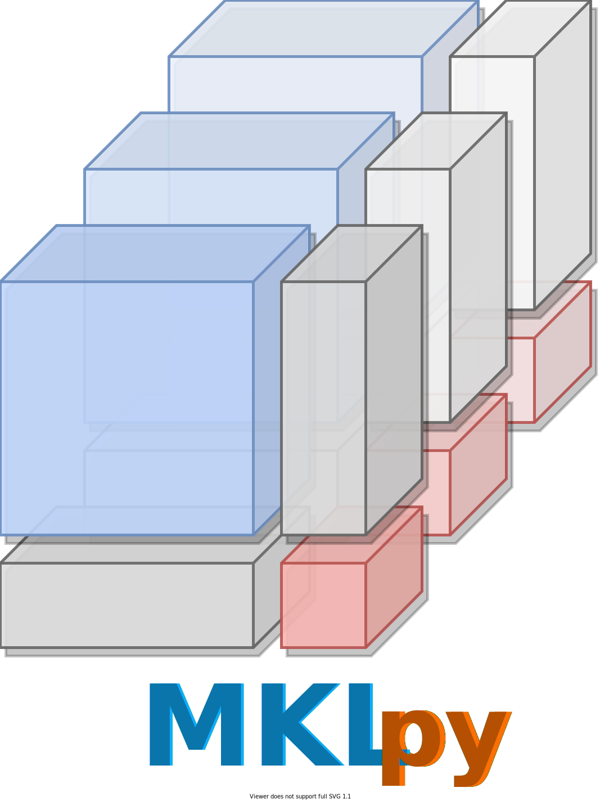

# MKLpy


**MKLpy** is a framework for **M**ultiple **K**ernel **L**earning (MKL)  inspired by the [scikit-learn](http://scikit-learn.org/stable) project.
The library encapsulates *everything you need* to run MKL algorithms, from the kernels computation to the final evaluation.




MKLpy contains:

* the implementation of MKL algorithms (**EasyMKL**, **GRAM**);
* kernel functions (**polynomial**, **boolean** kernels, and **string** kernels);
* various metrics and tools (kernel_alignment, radius, margin, spectral ratio...)

The ```examples``` section contains useful snippets of code.


- - -

## Installation

MKLpy is available on **PyPI**:
```sh
pip install MKLpy
```

MKLpy requires [pytorch](https://pytorch.org/), [scikit-learn](https://scikit-learn.org/stable/), and [cvxopt](https://cvxopt.org/) installed.

!!! warning
	If you use MKLpy for a scientific purpose, please **cite** this library.

- - -

## Work in progress

MKLpy is under development! We are working to integrate several new features, including:

* further MKL algorithms, such as MEMO, and SimpleMKL;
* additional kernels for structured data (graphs, trees);
* efficient optimization


## Known issues

* When dealing with normalized kernels, you need to (i) compute the complete kernel matrix (training + test examples) and to (ii) split the matrix into training and test matrices. Currently, you cannot directly compute the normalized kernel for training and test. This is not efficient and it will be fixed in the next releases.

* Some boolean kernels (DNF and CNF kernels) are currently disabled.

* The documentation for developers, containing directives and tools to develop novel algorithms and functionalities, is currently not available.

